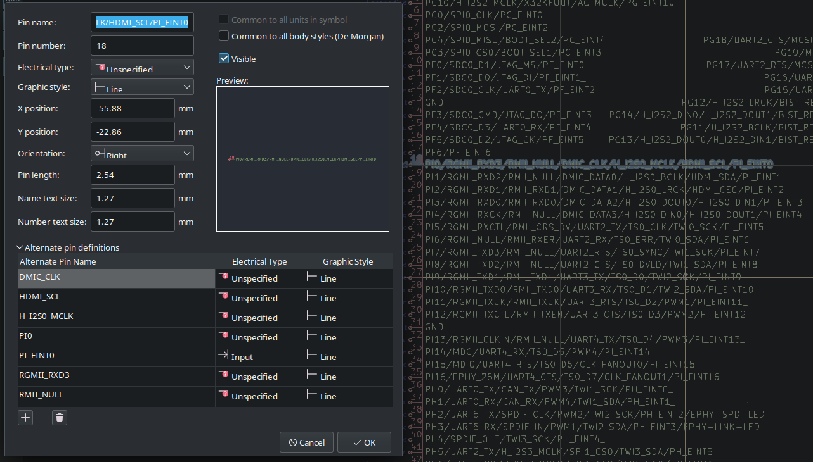
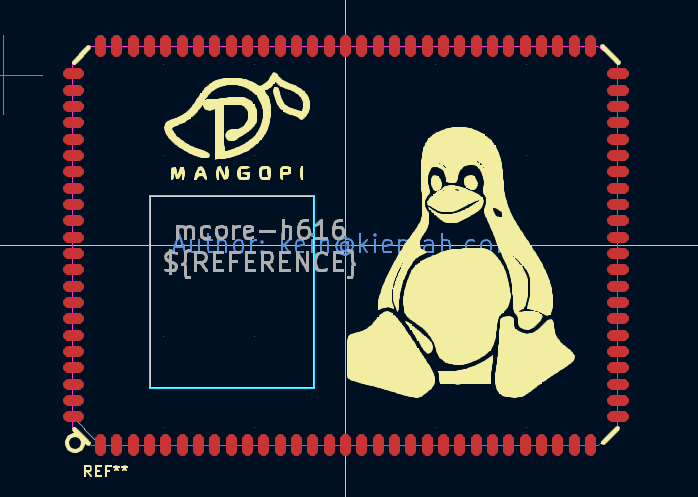

# mcore-h616 Kicad library

*Note: This is a part of KIENLAB's Kicad library*

The symbol and footprint was re-draw based on Altium library publish at [mangopi.org](https://mangopi.org/mcoreh616)

## Symbol

Every pin have a completed alternative pin definition, easy to change pin
function in eeschema. **However, due to my limit of time, almost alternative pins
was not specify direction.**

## Footprint

